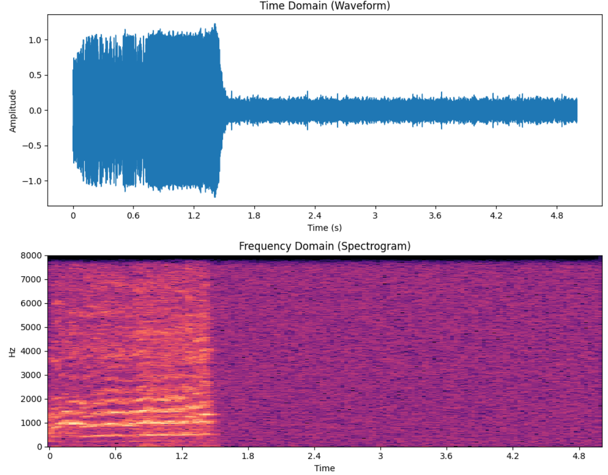
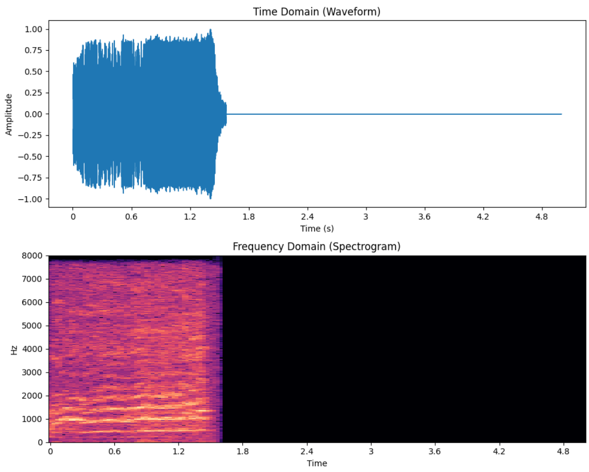
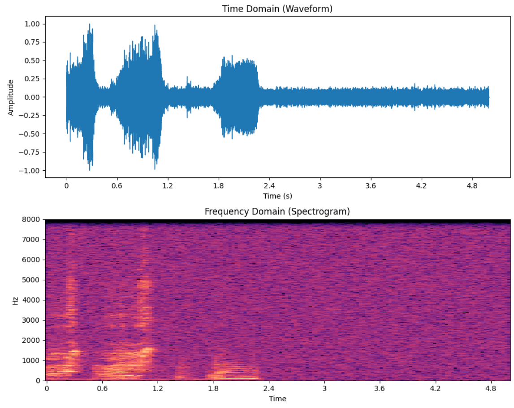
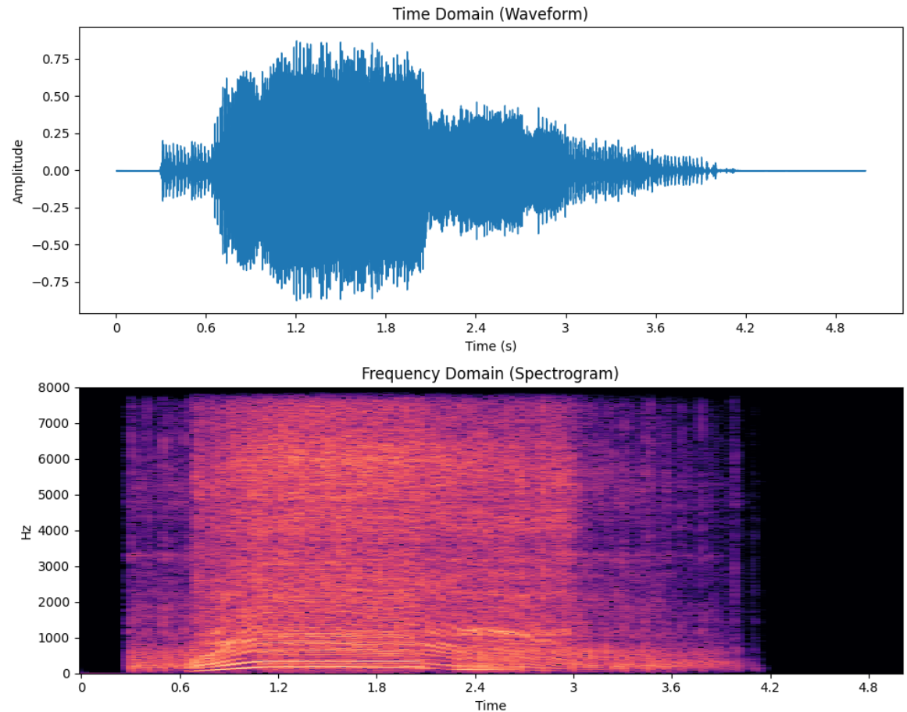
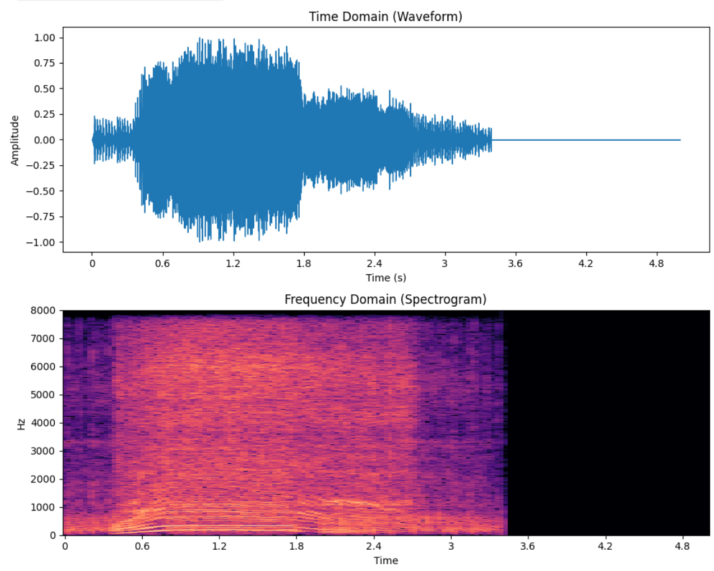

# Digital Signal Processing Project for group Pr_40

## Running and reproducing this Repo
If you have git, make you can do `git clone https://github.com/sp0002/dsp-project.git`. If not, download this repository as zip.

You can run the file either in Google Colab or locally on your computer.

### Google Colab instructions
1. Upload `notebook.ipynb` to Google Colab
2. Mount Google Drive and set `TRAIN_DIR`, `SUBMISSION_DIR`
3. Change `environment = 'local'` to `environment = 'colab'`
4. Change the `DATA_ROOT = "./content/"` under "3) Set paths (EDIT ME IF REQUIRED)".
5. Run all cells in order

### Local computer instructions
1. Unzip the folder to your desired location.
2. Download and install Python if it is not installed.
3. Download and install Visual Studio Code if it is not installed.
4. Open Visual Studio Code, click File > Open Folder.
5. Choose the folder with the project.
6. Double-click on the file CEG3004_Project_Data.ipynb
7. Change the `DATA_ROOT = "./content/"` under "3) Set paths (EDIT ME IF REQUIRED)".
8. On the top bar, click on Run All.
9. Depending on your computer, it can take some time to complete.
10. The predictions are under Pr_40_predictions.csv

CEG3004_Project_Visualise.ipynb is availavle to visualise how the filters work on the audio tracks and to check the accuracy of the final submission.

## Decisions

### Preprocessing Pipeline

**Silence trimming (`librosa.effects.trim`, top_db=20)**

This trims the starting and ending silence, treating anything 20 dB below the peak as silent. Without trimming, a model may learn that silence is a feature of a sound class, when it is actually nothing unique to the class. For clean clips like most in the dataset, the effect is minimal, but for noisy submission clips where silence regions may contain low-level static, trimming can prevent that noise floor from being treated as signal.
    
 to  ("silence" removed.)

[image](./img/1_5-103418-A-2__noisy_pre.png) to  (no effect.)

**Peak normalisation (`librosa.util.normalize`)**

Peak normalisation is to adjust the volume of the audio clips such that the loudest peak has unit amplitude. Without it, a louder clip would produce larger RMS, spectral energy, and MFCC values, making the model sensitive to recording level rather than sound class identity. This is essentially like amplification: where all the frequencies are made louder while the ratio is still kept the same. Doesn't do much for this dataset right now, but it also ensures augmented clips later on (after noise addition or bandpass filtering) are on the same amplitude scale as the originals.

**Fixed-length padding to 5s (`librosa.util.fix_length`)**

To keep all recordings to be the same data length to feed into the model fixed-length padding to 5s is used, since the maximum is 5s and is not too long.
 to  ("silence" removed, then padding added to hit 5s.)

### Feature Extraction
- **Spectral contrast** - Distinguishes smooth vs peaky textures across classes by comparing energy in the lower/higher frequency bands. This distinguishes tonal sounds (e.g. instruments, speech) from broadband noise (e.g. rain, fire crackling), making it sensitive to the texture of a sound rather than just its average energy.
- **Per-channel energy normalization (PCEN) mel spectrogram** (64 mel bins, 200–5000 Hz) - replaces the standard log-mel transform with an adaptive gain control that suppresses slowly varying background noise. This makes the representation better to train for the stationary noise added in noisy submission clips, where a log-mel spectrogram would compress both signal and noise equally.
- **Mel-Frequency Cepstral Coefficients (MFCC) and 1st and 2nd order Derivatives** (CMVN applied) - compress the mel spectrogram into a compact representation of spectral shape. CMVN (cepstral mean and variance normalisation) removes channel-level bias so features are comparable across clips recorded in different acoustic conditions. The 1st and 2nd order derivative coefficients capture how the spectral shape changes over time, encoding temporal dynamics that static MFCCs might miss.
- **Chroma (STFT-based, 12 bins)** - represents the distribution of energy across the 12 pitch classes, independent of octave. This captures harmonic and tonal content that survives bandlimiting, since low-frequency harmonics remain intact even after high-frequency cutoff, helping the model recognise classes under bandlimited conditions.
- **Root Mean Square(RMS), Zero Crossing Rate(ZCR), Spectral Centroid, Spectral Bandwidth, Spectral Rolloff** - time-domain and spectral shape features that helps describe the sound waves in different ways.
- **Robust pooling** (mean, std, median, p25, p75 per feature row) - summarises each feature's time series into a fixed-length vector. Including median and percentiles alongside mean/std makes the representation less affected by transient outliers (e.g. a single loud frame in a noisy clip), which can skew mean/std pooling.

### Data Augmentation (Training Only)
Data Augmentation trys to mimic the submission dataset and trains the model to recognise more revelant features.
- **Additive Gaussian noise** - mimics noise floow in submission clips by adding between 1-5% static. The randomised amplitude prevents the model from learning a fixed noise level, improving generalisation across different noise intensities.
- **Butterworth bandpass (200–5000 Hz)** - mimics band-limited submission clips. A high filter order (10) produces a sharp rolloff, closely approximating the hard cutoff seen in the test data.

### Model
- **StandardScaler** in pipeline applied before the classifier to zero-mean and unit-variance normalise all features. This is critical for RBF SVM, whose kernel distance computation is sensitive to feature scale. Without scaling, features with large ranges (e.g. spectral centroid in Hz) would dominate the kernel.
- **SVC (RBF kernel, C=10, gamma='scale', class_weight='balanced')** - Support Vector Classifier with a radial basis function kernel, which can learn non-linear decision boundaries in the feature space. C=10 allows moderate margin violations, balancing bias and variance for this dataset size.

## Experiments
Here are some experiments ran to determine the best parameters> As there are too many parameters and tests, only a few are shown:

### With vs Without augmentation
| Type | precision | recall | f1-score | support | Macro-F1 |
| ---- | --------- | ------ | -------- | ------- | -------- |
| With (macro/weighted avg) | 0.84 | 0.83 | 0.83 | 720 | 0.856 |
| Without (macro/weighted avg) | 0.51 | 0.53 | 0.49 | 240 | 0.493 |

With all else equal, running with augmentation increases the accuracy significantly, even if the testing dataset is clean.

### SVC Regularization parameter (C) experiment
| C value | precision | recall | f1-score | support | Macro-F1 |
| ---- | --------- | ------ | -------- | ------- | -------- |
| C=1 | 0.74 | 0.71 | 0.71 | 720 | 0.706 |
| C=10 | 0.84 | 0.83 | 0.83 | 720 | 0.834 |
| C=50 | 0.84 | 0.83 | 0.83 | 720 | 0.834 |

With all else equal, we can see that when C=1, accuracy is not as good as when C=10. When C=10 and C=50, the resuls are the same. Hence C=10 is used.

### Mel number of bins
training:
| Type | precision | recall | f1-score | support | Macro-F1 |
| ---- | --------- | ------ | -------- | ------- | -------- |
| n_mels=128 | 0.84 | 0.82 | 0.83 | 720 | 0.825 |
| n_mels=64 | 0.84 | 0.83 | 0.83 | 720 | 0.834 |

submission audio:
| Version | Clean Accuracy | Noisy Accuracy | Band-limited Accuracy |
|---|---|---|---|
| n_mels=128 | 45.00% | 36.50% | 35.00% |
| n_mels=64 | 47.25% | 39.50% | 34.75% |

Using n_mels=64 gives a better result while being less computationally expensive.

### With vs Without pre-emphasis
With: `y = librosa.effects.preemphasis(y, coef=0.97)  # Boost higher frequencies` accuracy against submission audio
| Version | Clean Accuracy | Noisy Accuracy | Band-limited Accuracy |
|---|---|---|---|
| With | 43.25% | 39.50% | 33.00% |
| Without | 41.50% | 41.25% | 38.00% |

Although using pre-emphasis boosts the accuracy of clean audio clips, noisy and band-limited accuracy takes a dip. Pre-emphasis is not used.

### Results
| Version | Accuracy |
|---|---|
| Clean | 54.25% |
| Noisy | 46.50% |
| Band-limited | 43.00% |

